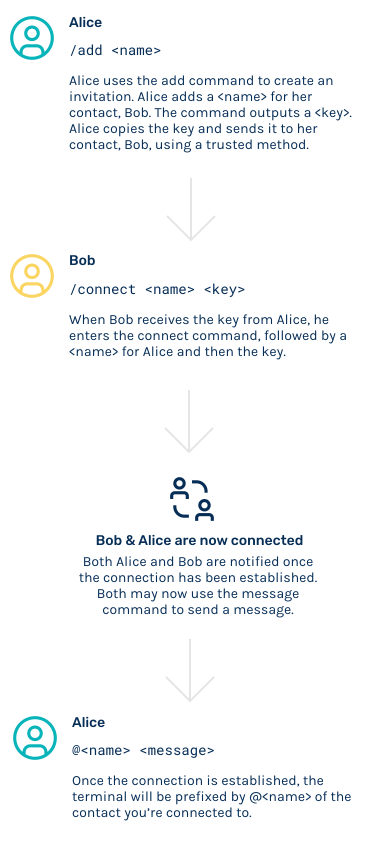

<h1 align="center">
    
</h1>
<h2 align="center">
    
</h2>

<div align="center">
    <a href="https://github.com/simplex-chat/simplex-messaging/actions?query=workflow%3Abuild" target="_blank">
        
    </a>
    <a href="https://github.com/simplex-chat/simplex-messaging/releases" target="_blank">
        
    </a>
    <a>
        
    </a>
    <!-- <a>
        
    </a> -->
</div>
<br>

SimpleX is an open-source messaging protocol that enables privacy-conscious software engineers and technology enthusiasts to be in full control of their communications.

SimpleX allows simple deployment of chat servers and easy to use chat clients providing complete privacy, security and ownership of your contacts and chat data.


<div align="center">
    
</div>

## Table of contents

- [Installation](#installation)
    - [Build locally](#build-locally)
    - [Docker build](#docker-build)
- [How SimpleX works](#how-simplex-works)
- [Features](#features)
- [Usage](#usage)
    - [Commands](#commands)
- [Development](#development)
- [Contribute](#contribute)
    - [Sponsor](#sponsor)
    - [Adding new features or fixing bugs](#adding-new-features-or-fixing-bugs)
- [License](#license)


## Installation

For Windows PCs and Macs you will need to install Haskell and run the chat client locally.


### Build locally

To run the chat locally, you will need to install [Haskell stack](https://docs.haskellstack.org/en/stable/README/).

To install Haskell stack, run:

```
curl -sSL https://get.haskellstack.org/ | sh
```

First clone the repo on your machine:

```
$ git clone git@github.com:simplex-chat/simplex-messaging.git
```

And run:

```
$ cd simplex-messaging
$ stack install
$ dog-food
```


### Docker build

Running SimpleX on Docker currently only works on machines running Linux.

To run SimpleX on Docker, first clone the project. If you don't have Docker installed you can get it [here](https://docs.docker.com/get-docker/). 

First clone the repo on your machine:

```
$ git clone git@github.com:simplex-chat/simplex-messaging.git
```

Then run:

```
$ cd simplex-messaging
$ DOCKER_BUILDKIT=1 docker build --output ~/.local/bin .
$ dog-food
```


[(Back to top)](#table-of-contents)

## Features

SMP protocol is semi-formally defined [here](https://github.com/simplex-chat/protocol):

### Current available features:

- Simple 1-to-1 chat with multiple people in the same terminal window.
- Auto-populated recipient name - just type your messages.
- Default server is available to play with - smp.simplex.im:5223 - and you can deploy your own (smp-server executable in this repo).
- No global identity or names visible to the server(s) - for the privacy of contacts and conversations.
- E2E encryption, with public key that has to be passed out-of-band (see below)
- Authentication of each command/message with automatically generated RSA key pairs, separate for each conversation, the keys are not used as identity (2048 bit keys are used, it can be changed in code via rsaKeySize setting)


### Feature roadmap

The following features are currently in development:

- Support for chat groups.
- Delivery notifications.

### Disclaimers

- Current build does not yet include TCP transport encryption. Messages are encrypted e2e; only random connection IDs and server commands are visible but not the contents of the message.

- System and protocol security have not been audited yet. As such, it is not advised to use SimpleX for high security communications.


[(Back to top)](#table-of-contents)

## Usage

To use SimpleX chat you need another contact to connect to. It takes just two steps in order to establish a connection.

The below diagram illustrates how a connection is made:

<div align="center">
    
</div>


### Markdown
### Deploy SimpleX server


SimpleX supports Markdown.

[(Back to top)](#table-of-contents)

## Development
[(Back to top)](#table-of-contents)


## Contribute
[(Back to top)](#table-of-contents)
...

### Sponsor

Display any sponsors or encourage people/organisations to sponsor SimpleX.
[(Back to top)](#table-of-contents)

### Adding new features or fixing bugs
[(Back to top)](#table-of-contents)

<!-- This is to give people an idea how they can raise issues or feature requests in your projects. 

You could also give guidelines for submitting and issue or a pull request to your project.

Personally and by standard, you should use a [issue template](https://github.com/navendu-pottekkat/nsfw-filter/blob/master/ISSUE_TEMPLATE.md) and a [pull request template](https://github.com/navendu-pottekkat/nsfw-filter/blob/master/PULL_REQ_TEMPLATE.md)(click for examples) so that when a user opens a new issue they could easily format it as per your project guidelines.

You could also add contact details for people to get in touch with you regarding your project. -->

## License
[(Back to top)](#table-of-contents)

